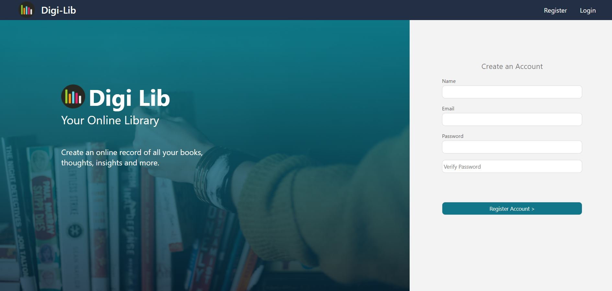

# Digi-Lib
> A website built with the MERN stack which acts as a digital library; holding the user's books and insights.

### Google Books API and Book Data
- Ideally, such a site would have its own database to manage it's own book data.
- For the purposes of this project, I'm making use of Google Books API which means it's subject to restrictions.
  - Whilst I'm unlikely to host this site anywhere, I still want to respsect the terms of service that state any data stored from the API must be deleted after 30 days.
  - Therefore, Instead of following my original idea of simply 'caching' each book as the user adds them to my own Book model in the databse, I will store a list of Google-Book-API ID's for each user and unfortunately, will need to call the API for each ID to gather the data again.
  - This will result in many API calls; for instance the user library; if it contains 300 books would require 300 calls.
    - The API is limited at 1000 calls a day, so clearly this isn't convenient. Ultimately though were this a full on project, it would rely on our own book stores anyway hence these restrictions don't matter.